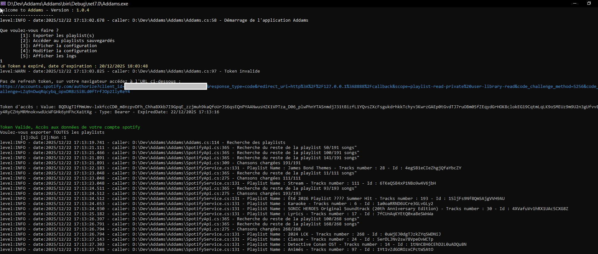
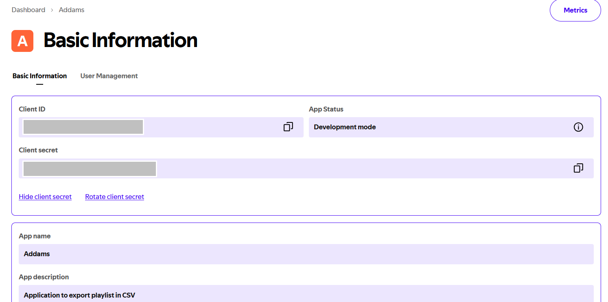
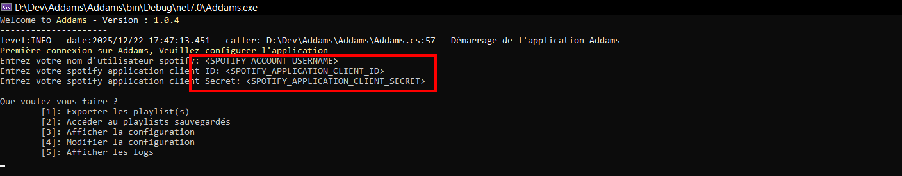
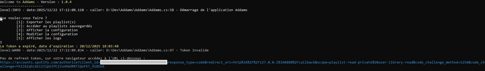
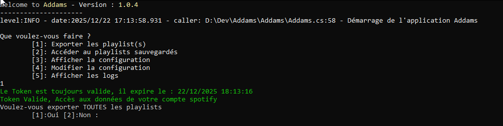
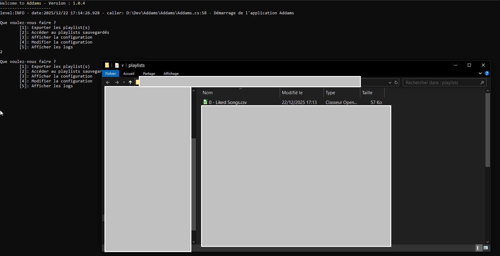
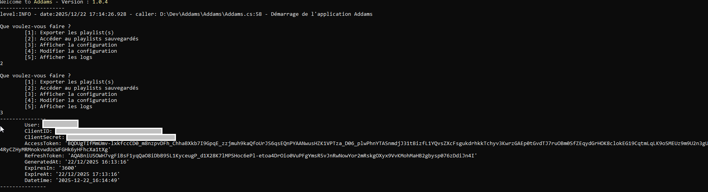

# Addams




[](https://app.codacy.com/gh/NY-Daystar/Addams/dashboard?utm_source=gh&utm_medium=referral&utm_content=&utm_campaign=Badge_grade)
[](https://github.com/NY-Daystar/addams/actions/workflows/dotnet.yml) [](https://www.gnu.org/licenses/gpl-3.0) [](https://github.com/NY-Daystar/addams/releases)

  

   []

  

C# project to export in csv spotify user's playlist  
Source code analysed with [DeepSource](https://deepsource.com/) and [Codacy](https://app.codacy.com)

**Version: v1.0.4**

## Summary

-   [Requirements](#requirements)
-   [Get started](#get-started)
    -   [Create spotify application](#setup-spotify-application)
    -   [Launch Addams](#launch-addams-application)
-   [For developer](#for-developpers)
    -   [Setup project](#setup-project)
    -   [How it works](#how-it-works)
    -   [Unit tests](#tests)
-   [Contact](#contact)
-   [Credits](#credits)

## Requirements

-   [.NET Framework](https://dotnet.microsoft.com/en-us/download/dotnet/7.0) >= 7.0
-   [VS 2022](https://visualstudio.microsoft.com/fr/vs/) >= 2022

## Get Started

### Setup spotify application

1. You need to create an application on spotify in this [link](https://developer.spotify.com/dashboard)

2. Click on create an app

    1. Set app name: `Addams`
    2. Set app description: `C# tool to export spotify playlist`

3. Click into your app created then get value of `Client ID` and `Client Secret`

You will get something like this



> **IMPORTANT: You can delete your app in this [link](https://www.spotify.com/fr/account/apps/)**

### Launch Addams application

4.  You can download the `Addams Application` by [this link](https://github.com/NY-Daystar/Addams/releases/download/v1.0.4/AddamsInstaller-v1.0.4.msi)

5.  Install it and launch `Addams.exe`

6.  First you need to setup configuration (user account, client id and secret of spotify application)
    

7.  Then you can authentify your spotify application into Addams like below
    

> After that, the token renewal itself like this
> 

8.  Then you have multiple actions like export and/or show playlists, change configuration of application
      
    

## For developpers

### Setup project

1. Clone repository

```bash
$ git clone git@github.com:NY-Daystar/Addams.git
```

2. Open VS 2022 -> `Open project or solution`
3. Select `Addams.sln`
4. Rebuild solution
5. F5 to launch project in Debug mode

You can activate git hooks with this command

```bash
git config --global core.hooksPath .githooks
```

### How it works

The project setup an OAUTH2 token with your [spotify app credentials](#setup-spotify-application) to execute spotify api request

-   [Official guide in spotify](https://developer.spotify.com/documentation/web-api/tutorials/code-pkce-flow)
-   [Authentication guide](https://johnnycrazy.github.io/SpotifyAPI-NET/docs/auth_introduction)
-   [Use authorization code with PKCE](https://johnnycrazy.github.io/SpotifyAPI-NET/docs/pkce)
-   [To understand redirect uri changes](https://developer.spotify.com/documentation/web-api/concepts/redirect_uri)

Once all data fetched we create a csv for each playlist with track's data:

-   `Track Name` : Name of the track
-   `Artist Name(s)` : List of artist (separated by `|`)
-   `Album Name` : Name of the album
-   `Album Artist Name(s)` : Album's artists (separated by `|`)
-   `Album Release Date` : Release date of the album (`YYYY-MM-DD`)
-   `Disc Number` : If album has multiple disc
-   `Track Duration` : Time duratio of the track (`minutes:secondes`)
-   `Track Number` : Number of the track in the album
-   `Explicit` : If track is explicit or not (`True or False`)
-   `Popularity` : Number in range 0-100 for unpopular to very popular
-   `Added At` : Datetime when you add this track in your playlist
-   `Track Uri` : Spotify url of the track
-   `Artist Url` : Spotify url of the artist
-   `Album Uri` : Spotify url of the album
-   `Album Image Url` : Url image of the album
-   `Track Preview Url` : Url track preview of the album (30sec audio)

These csv are saved in the same path of Addams.exe in a folder name `data`

### Tests

you can run unit tests in `Addams.Tests` project

## Contact

-   To make a pull request: https://github.com/NY-Daystar/addams/pulls
-   To summon an issue: https://github.com/NY-Daystar/addams/issues
-   For any specific demand by mail: [luc4snoga@gmail.com](mailto:luc4snoga@gmail.com?subject=[GitHub]%addams%20Project)

## Credits

Made by Lucas Noga.  
Licensed under GPLv3.
